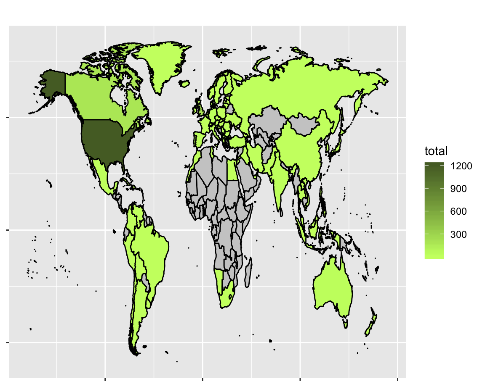
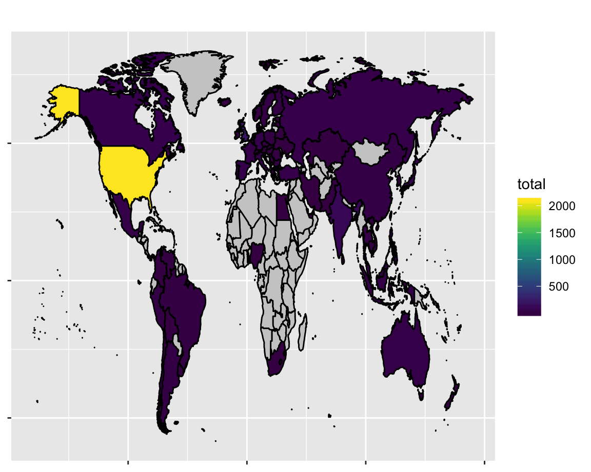
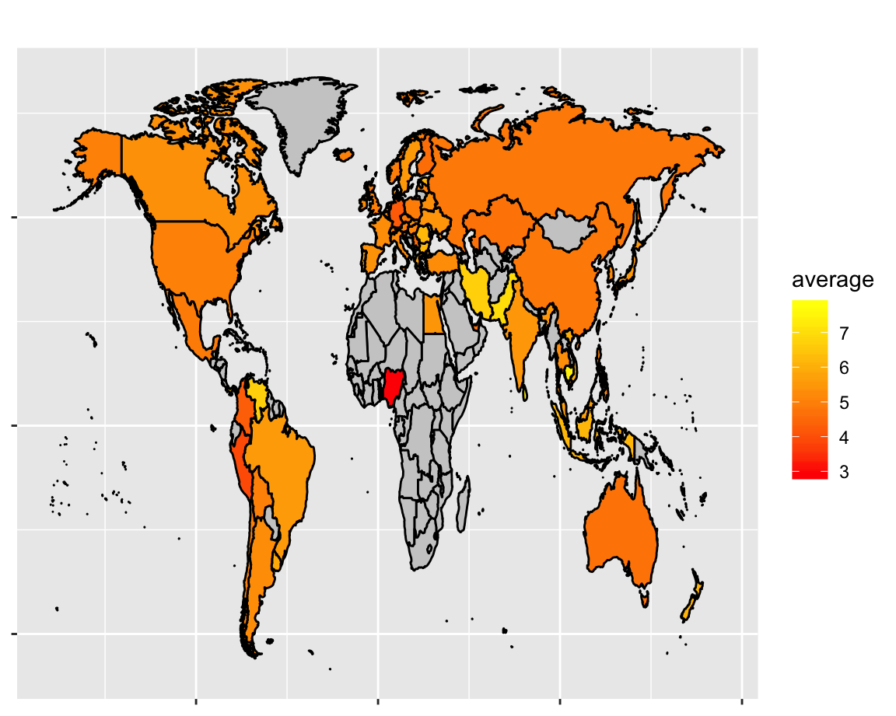
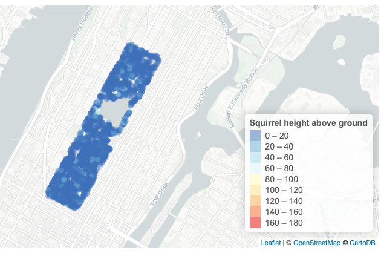
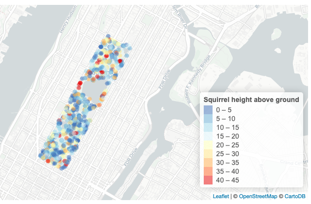
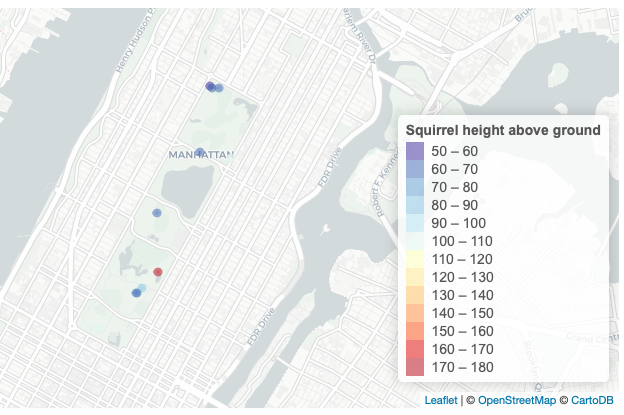
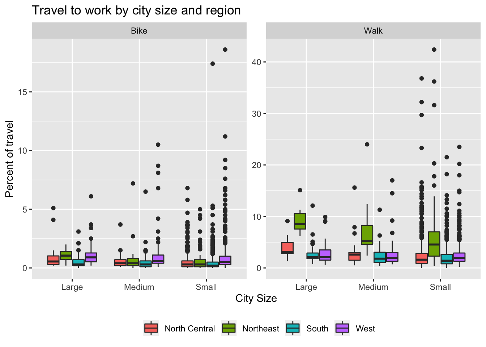
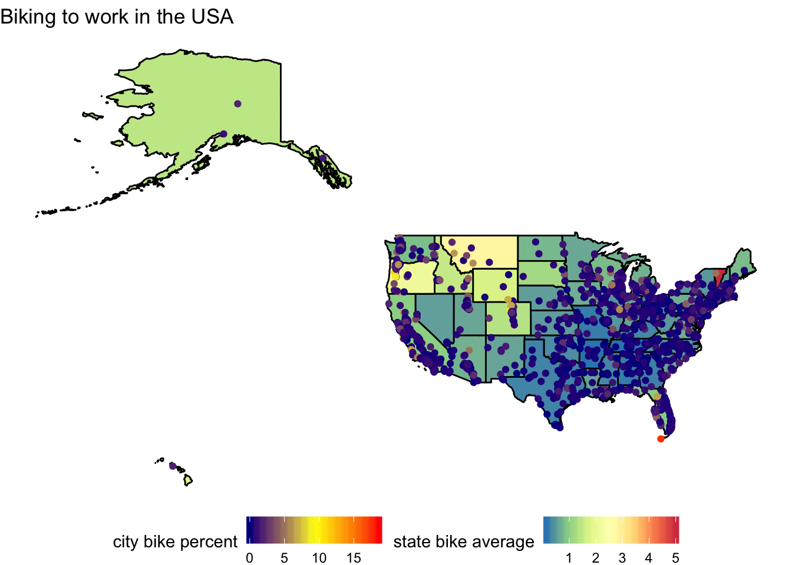
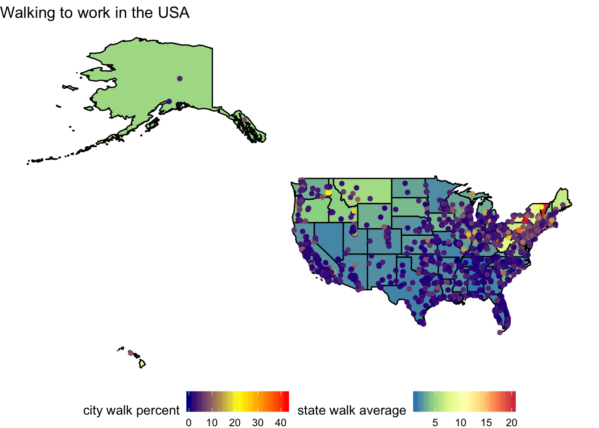

# My contributions to TidyTuesdays

## [Horror movies, 2019 week 43](https://k-maciejewski.github.io/TidyTuesdays/2019w43/TT_2019_w43.html)

Link to dashboard above, see folder for code and more.

For my first tidy Tuesday, I explored the [dataset of horror movies](https://github.com/rfordatascience/tidytuesday/tree/master/data/2019/2019-10-22). 

### Horror movie filming location in each country from 2012 to 2017

### Horror movies released by country from 2012 to 2017

### Horror movie ratings by country from 2012 to 2017

## [SQUIRREL!! 2019 week 44](https://k-maciejewski.github.io/TidyTuesdays/TT_2019_44.html)

Link to page above, see folder for code and more.

This tidy tuesday explores the [squirrel census!](https://www.thesquirrelcensus.com). I took the opportunity to try to learn a little [Leaflet.](https://leafletjs.com)

The first map shows all squirrels with given distance above ground at which they were sighted. NA's were filtered out. According to [the data dictionary](https://github.com/rfordatascience/tidytuesday/tree/master/data/2019/2019-10-29#data-dictionary), fields were populated with a value of “FALSE” if the squirrel was on the ground plane so these values were changed to zeros. This map is mostly filled with dark blue, the color of ground-dwelling squirrels.

### All squirrels

### Heights below 50, and above ground level

### Heights above 50 

## [Walk or Bike to work](https://k-maciejewski.github.io/TidyTuesdays/TT_2019_45.html)

This week is [Modes Less Traveled - Bicycling and Walking to Work in the United States: 2008-2012](https://github.com/rfordatascience/tidytuesday/tree/master/data/2019/2019-11-05) from the  [ACS](https://www.census.gov/library/publications/2014/acs/acs-25.html?#).

The `commute.csv` dataset on Github was tidied from 6 raw excel files. The code and final dataset was already provided.

### Box plots of mode of transport, by city size and US region

### Maps of walk or bike, coloring by city average and state average

